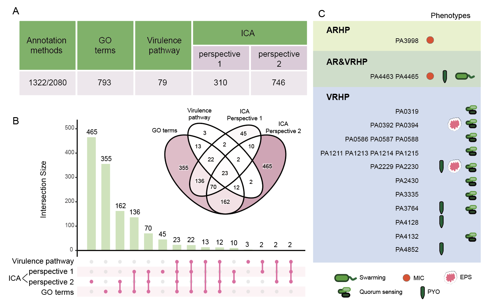

# PA-HP

This GitHub repository contains all the custom scripts and shell commands used in our paper,

**Characterization of Hypothetical Proteins Reveals Function Modules and Virulence Factors in Pseudomonas aeruginosa**

## Graphic abstract

## Data available
Our HP functional annotation data is available via a GUI (https://jiadhuang0417.shinyapps.io/PA_HP/)

All raw sequence files are uploaded to NCBI (GEO:[GSE256222](https://www.ncbi.nlm.nih.gov/geo/query/acc.cgi?acc=GSE256222)).

Processed DEG files and ICA matrix are uploaded to [Zenodo](https://doi.org/10.5281/zenodo.20453783).

If you have any further requests, please contact xindeng@cityu.edu.hk. We are pleased to help!

## Code available

System requirement: Ubuntu 22.04; R version: 4.5.1.

**Notes:** We highly recommend creating a separate conda environment to manage the following software tools.
## iModulon calculation

The iModulon results generated are by iModulonMiner. Specifically:

ICA Calculation: The core ICA decomposition, including the algorithm implementation and factor rotation, is handled by run_ica.sh in [iModulonMiner
](https://github.com/SBRG/iModulonMiner/tree/main).

iModulon Characterization: The iModulon annotation process and part of data visualization is handled by [PyModulon](https://github.com/SBRG/pymodulon).

For an in-depth understanding of these foundational steps, please consult the iModulonminer documentation and source code. 

## Cite us
DOI available later~

## LICENSE
This project is licensed under the MIT License. See the LICENSE file for details.
